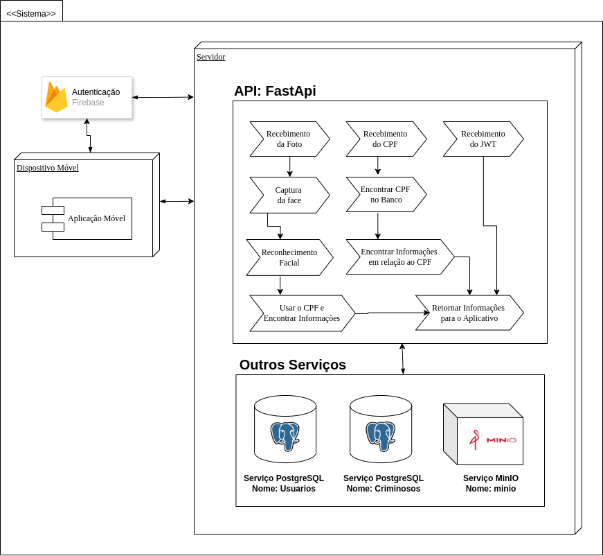

<h1 align="center"> FaceCheck </h1>

  

## Sumário

* [Integrantes](#integrantes)
* [Descrição](#descrição)
* [Requisitos](#requisitos)
* [Tecnologias](#tecnologias)
* [Fluxo do Software](#fluxo-do-software)
* [Dificuldades](#dificuldades)
* [Resultados](#resultados)
* [Conclusao](#conclusao)

## Integrantes

- Anderson do Vale - [and3510](https://github.com/and3510) 
- Beatriz Barreto - [whosbea](https://github.com/whosbea)
- Cristovam Paulo - [cristovam10000](https://github.com/cristovam10000)
- Gustavo do Vale - [gustavodovale](https://github.com/gustavodovale)
- Lucas Cesar

## Descrição

Desenvolvimento de um aplicativo de segurança pública que utiliza reconhecimento facial baseado em IA para identificação de indivíduos durante abordagens policiais. O sistema compara a imagem capturada com um banco de dados oficial e exibe informações como nome, CPF e pendências judiciais. Caso haja mandado de prisão ativo, um alerta é enviado ao policial, agilizando a tomada de decisão.

## Requisitos

#### **1. Captura de Imagem**  
- Permitir a captura de imagem em tempo real via câmera do dispositivo móvel.  
- Processar a imagem capturada para extração das características faciais.  

#### **2. Processamento e Reconhecimento Facial**  
- Identificar pontos-chave do rosto para comparação com registros armazenados.  
- Realizar a correspondência entre a imagem capturada e as fotos cadastradas no banco de dados.  

#### **3. Consulta e Validação da Identidade**  
- Consultar o banco de dados e validar a identidade do indivíduo.  
- Recuperar e exibir as seguintes informações em caso de correspondência:  
  - Nome completo  
  - Nome da mãe  
  - CPF  

#### **4. Verificação de Pendências Judiciais**  
- Verificar automaticamente se há registros de busca ou mandados de prisão ativos.  
- Realizar a consulta de forma automática e em tempo real.  

#### **5. Exibição de Resultados**  
- Exibir a confirmação da identidade na interface do usuário.  
- Gerar um alerta para o policial caso haja alguma pendência judicial.  

#### **6. Segurança e Privacidade**  
- Restringir o acesso ao sistema apenas a usuários autorizados.  
- Registrar todas as consultas para fins de auditoria e segurança.  
- Garantir que o armazenamento e processamento das informações sigam normas de proteção de dados.  

## Tecnologias

- Python
- Dart
- Flutter
- Firebase
- Docker
- Postgresql

## Fluxo do Software

 

## Dificuldades

- Tempo de Realização e Testes

## Resultados

## Conclusao

